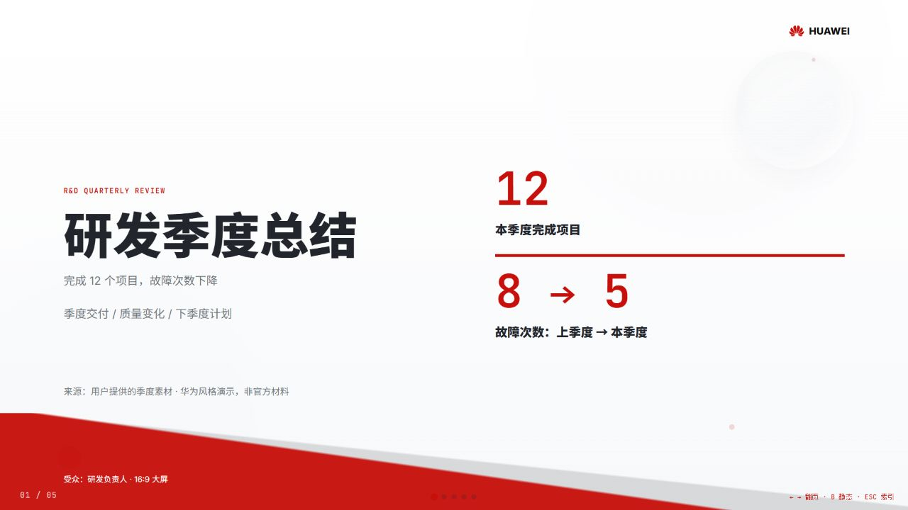
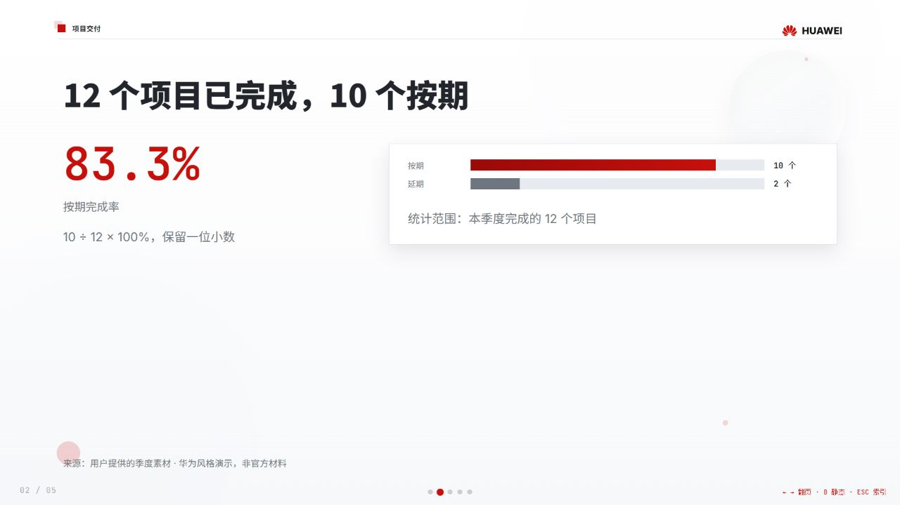
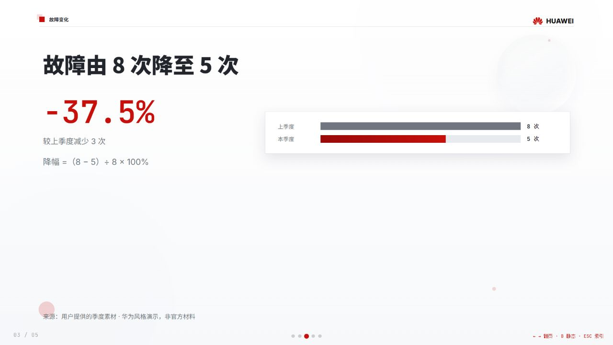
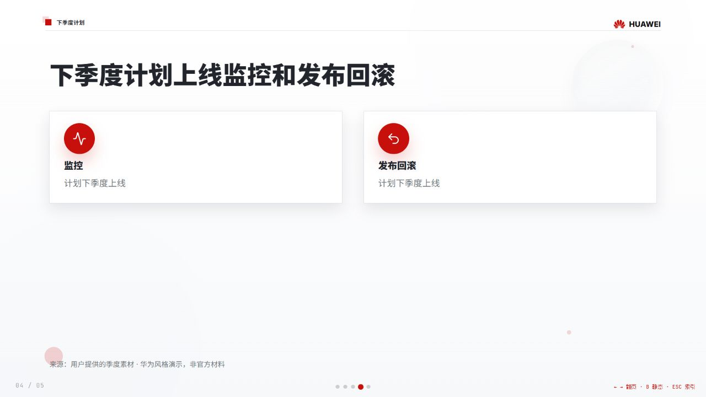
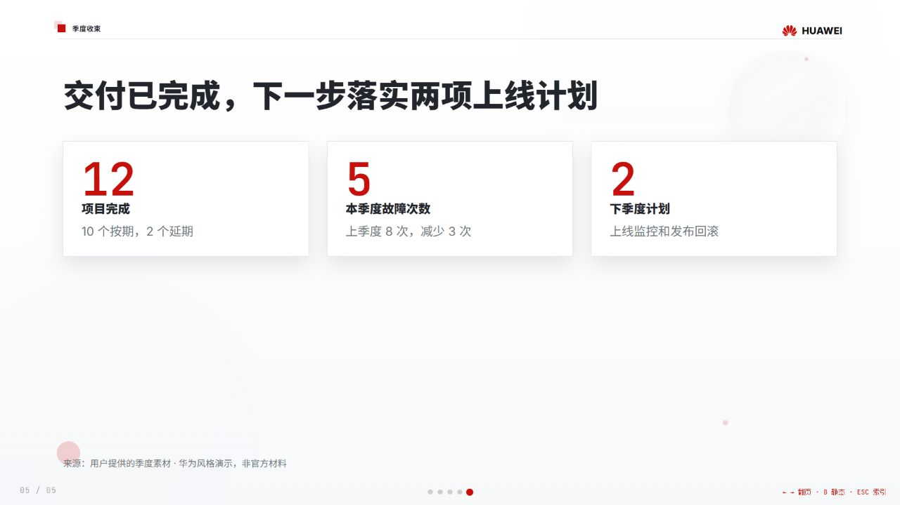

# 华为风格 PPT Skill

面向战略汇报、架构总览、经营分析和方案对比，先整理事实与因果，再做分页和视觉交付。

## 最新实测演示：研发季度总结

由独立 sub-agent 使用当前 skill 制作的 5 页 HTML PPT，以下为 1280×720 浏览器实拍，替代旧版演示。包含季度总览、项目交付、故障变化、下季度计划和总结。

[完整 HTML 源码](examples/rd-quarterly/index.html) · [下载 HTML](https://raw.githubusercontent.com/zuiho-kai/huawei-style-ppt-skill/master/examples/rd-quarterly/index.html) · [内容蓝图](examples/rd-quarterly/blueprint.md) · [使用与许可](examples/rd-quarterly/README.md)

下载 HTML 后用浏览器打开，使用方向键或滚轮翻页，`B` 切换静态模式，`ESC` 打开索引。GitHub 文件页展示的是源码；字体和图标默认需要联网。



<details>
<summary>展开其余 4 页实测截图</summary>









</details>

5 页成品通过静态校验及浏览器逐页检查，翻页与静态模式可用。已知限制：1280×720 下 ESC 索引缩略图右侧会裁切，不影响正常页面。演示数据为测试素材，非华为官方材料。

## 本次更新（2026-09-20）

- 同步 clowder-ai 最新 PPT Forge 的事实取材、叙事清晰度与避免重复确认流程。
- 接入 `seandongx/guizang-ppt-skill` 的华为网页 PPT：42 种版式、3 套红灰主题、模板和两个校验脚本。
- 保留原有 imagegen 逐页出图、低保真蓝图、大屏可读性和生成后文字复核。
- 按模式加载资源，HTML 模式无需图像生成能力；不承诺原生可编辑 PPTX。

## 安装与使用

复制完整的 `ppt-forge/`，包括 `references/` 和 `vendor/`：

```bash
# Codex
cp -r ppt-forge ~/.codex/skills/
# Claude Code
cp -r ppt-forge ~/.claude/skills/
```

需求示例：

> 做一套华为式技术方案汇报，受众是 CTO，大屏展示，内容可以适度精简，逐页出图。

> 用华为风格做 10 页年度工作总结，交付能在浏览器翻页的 HTML，使用归藏模板。

信息不足时先列明假设和分页方案；已有明确蓝图或直接制作授权时继续执行，不重复确认。

## 输出模式

| 模式 | 能力与前置条件 | 边界 |
|---|---|---|
| Low-fi Markdown | 内容分析、分页、文字清单和蓝图 | 不含最终视觉稿 |
| Raster PNG（默认） | 宿主具备 image-generation / imagegen 工具，逐页生成 | 文字和图表不可独立编辑 |
| HTML deck | 内置归藏 Style C 模板，Node.js 做静态检查、浏览器做视觉验收 | HTML 源码可修改；不是 PPTX；字体与图标默认依赖 CDN |
| Editable PPTX handoff | 交付蓝图、文字清单和素材，转交独立原生 PPTX 工具 | 本仓库不实现 PPTX authoring/export |

没有 imagegen 时，raster 模式停在低保真稿，并说明 HTML 选项。HTML 与 raster 使用各自完整色板，不混用主题变量。

## 目录

```text
ppt-forge/
├── SKILL.md
├── agents/openai.yaml
├── references/
│   ├── narrative-clarity.md
│   ├── ppt-lofi-authoring.md
│   ├── ppt-style-huawei.md
│   └── ppt-html-authoring.md
└── vendor/guizang/
    ├── LICENSE
    ├── UPSTREAM.md
    ├── assets/template-huawei.html
    ├── references/{layouts,themes}-huawei.md
    └── scripts/validate-huawei-{template,deck}.mjs
```

## 验收

一页一个主结论；密度服从观看距离，放不下优先拆页。逐项核对文字、数据、单位和来源，整套并排检查字体、色板和装饰是否一致。

HTML 模式先运行：

```bash
cd ppt-forge/vendor/guizang
node scripts/validate-huawei-template.mjs
node scripts/validate-huawei-deck.mjs /absolute/path/to/index.html
```

再在浏览器检查全部页面、翻页、索引和静态模式；静态检查通过不代表视觉验收通过。详细操作见 [HTML 制作规范](ppt-forge/references/ppt-html-authoring.md)。

## 上游与许可

| 来源 | 同步基线 | 本次处理 |
|---|---|---|
| [zts212653/clowder-ai](https://github.com/zts212653/clowder-ai) | `22385b60e01aee9d8691b6a867836ff0e94fa77f` | 吸收 PPT Forge 叙事更新，内置精简叙事参考；低保真与华为 preset 相对旧基线无上游变化，保留本仓库增强 |
| [seandongx/guizang-ppt-skill](https://github.com/seandongx/guizang-ppt-skill) | `8653aaca8d2949cd576752704dc50671a4f35854` | 原样引入华为模板、版式、主题和校验器；原作者为 [歸藏 / op7418](https://github.com/op7418/guizang-ppt-skill) |

原有 PPT Forge 文档与 MIT 改编部分继续遵循 [MIT](LICENSE)。`ppt-forge/vendor/guizang/` 遵循独立的 [AGPL-3.0](ppt-forge/vendor/guizang/LICENSE)，不是 MIT；模板衍生作品也须遵守相应许可。分发 HTML 时附带许可、来源和适用的源码获取方式。版本和文件映射见 [UPSTREAM.md](ppt-forge/vendor/guizang/UPSTREAM.md)。
